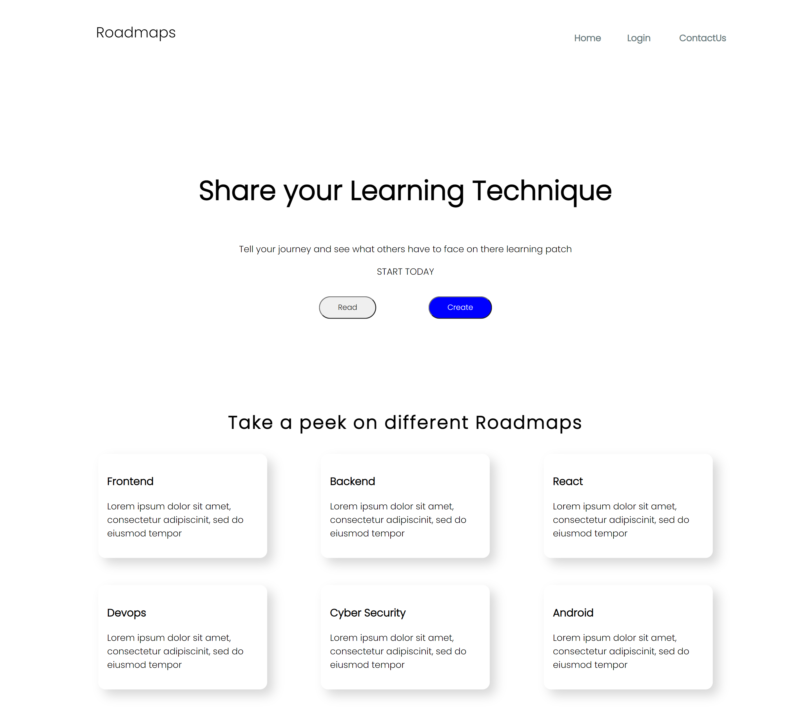

# Roadmap - Share your Learning Technique

This is a submission project for hackathon hack-o-uplift.

Roadmap will be a platform where developers can share
their stories, their paths that they have taken to learn new tech stacks.

## Table Of Contents

- [Overview](#overview)
  - [Screenshot](#screenshot)
  - [Built with](#built-with)
  - [Continued development](#continued-development)
  - [Author](#author)

## Overview and features
Our projected is based upon themes education and community.
It will help people to build community along there way of learning.

> Our project will provide a platform to people where they can share what they are learning or have learned in the form of roadmaps, which other people can view and also rate it on the basis of how helpful is that for them.

> People can sign-up/login, build roadmaps, view others roadmaps, get connected each other in this platform or other platforms like GitHub or twitter.

> In the roadmaps users/developers can share topics, links of the courses , their strategies and how much duration they have put in learning.

: In future we will be adding proper github repository which will include whole documentation and samples of roadmaps that user can make according to his experience.
### Screenshot

### Built with

- [Reactjs](https://reactjs.org/)
- [react-router](https://reactrouter.com/)
- [sawo](https://sawolabs.com/)
- [nodejs](https://nodejs.org/en/)

### Continued development
- add user dashboard 
- database to store information about the user.
- database to store information about the roadmaps that can be fetched when requested

### Authors
 - [Unnati Aggarwal](https://github.com/unnati-dot)
 - [Soransh Singh](https://github.com/soransh-singh)
